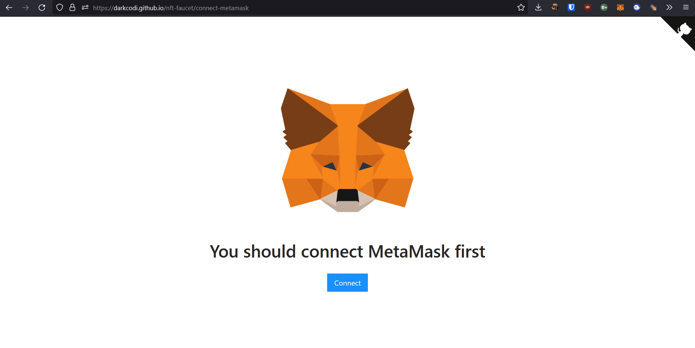

# NFT Faucet
  
  
It's a WASM web-application that allows you to mint ERC-721 and ERC-1155 tokens to any specified ethereum address.
  
## Requirements
- installed [Metamask](https://metamask.io/download/) extension
- some test ETH (or MATIC) to pay for a blockchain transaction fee  
(faucets: [Ropsten](https://faucet.egorfine.com/), [Mumbai](https://mumbaifaucet.com/), etc.)
  
## Demo
Go to https://darkcodi.github.io/nft-faucet/  
  
  

## Deployed contracts
Used [contracts](NftFaucet/Contracts) are based on [OpenZeppilin contracts](https://github.com/OpenZeppelin/openzeppelin-contracts), but with one unusual feature - `mint` method can be called by anyone, not just by an owner.    

|                 | ERC-721   | ERC-1155   |
|-----------------|-----------|------------|
| Ropsten         | [0x71902F99902339d7ce1F994C12155f4350BCD226](https://ropsten.etherscan.io/token/0x71902F99902339d7ce1F994C12155f4350BCD226) | [0x80b45421881c0452A6e70148Fc928fA33107cEb3](https://ropsten.etherscan.io/token/0x80b45421881c0452A6e70148Fc928fA33107cEb3) |
| Rinkeby         | [0x9F64932Be34D5D897C4253D17707b50921f372B6](https://rinkeby.etherscan.io/token/0x9F64932Be34D5D897C4253D17707b50921f372B6) | [0xf67C575502fc1cE399a3e1895dDf41847185D7bD](https://rinkeby.etherscan.io/token/0xf67C575502fc1cE399a3e1895dDf41847185D7bD) |
| Goerli          | [0xC3E4214dd442136079dF06bb2529Bae276d37564](https://goerli.etherscan.io/token/0xC3E4214dd442136079dF06bb2529Bae276d37564) | [0x5807d7be82153F6a302d92199221090E3b78A3C3](https://goerli.etherscan.io/token/0x5807d7be82153F6a302d92199221090E3b78A3C3) |
| Kovan           | [0x99ea658e02baDE18c43Af5Fa8c18cfF4f251E311](https://kovan.etherscan.io/token/0x99ea658e02baDE18c43Af5Fa8c18cfF4f251E311) | [0xdBDD0377D1799910A4B0a4306F8d812265bF33Cb](https://kovan.etherscan.io/token/0xdBDD0377D1799910A4B0a4306F8d812265bF33Cb) |
| OptimismKovan   | [0xee52f32f4bbcedc2a1ed1c195936132937f2d371](https://kovan-optimistic.etherscan.io/token/0xee52f32f4bbcedc2a1ed1c195936132937f2d371) | [0xCc0040129f197F63D37ebd77E62a6F96dDcd4e0A](https://kovan-optimistic.etherscan.io/token/0xCc0040129f197F63D37ebd77E62a6F96dDcd4e0A) |
| PolygonMumbai   | [0xeE8272220A0988279627714144Ff6981E204fbE4](https://mumbai.polygonscan.com/token/0xeE8272220A0988279627714144Ff6981E204fbE4) | [0x23147CdbD963A3D0fec0F25E4604844f477F65d2](https://mumbai.polygonscan.com/token/0x23147CdbD963A3D0fec0F25E4604844f477F65d2) |
| ArbitrumRinkeby | [0x9F64932Be34D5D897C4253D17707b50921f372B6](https://testnet.arbiscan.io/token/0x9F64932Be34D5D897C4253D17707b50921f372B6) | [0xf67C575502fc1cE399a3e1895dDf41847185D7bD](https://testnet.arbiscan.io/token/0xf67C575502fc1cE399a3e1895dDf41847185D7bD) |
| ArbitrumGoerli  | [0x9F64932Be34D5D897C4253D17707b50921f372B6](https://nitro-devnet-explorer.arbitrum.io/token/0x9F64932Be34D5D897C4253D17707b50921f372B6) | [0xf67C575502fc1cE399a3e1895dDf41847185D7bD](https://nitro-devnet-explorer.arbitrum.io/token/0xf67C575502fc1cE399a3e1895dDf41847185D7bD) |
  
## Technology stack

NOTE: The entire web app works as a static website, hosted on Github Pages. There is NO backend, it runs only in your browser! :)  

- Blazor WASM
- Metamask
- IPFS (upload provider - Infura, pinning provider - Crust)
- Solidity smart contracts
  
   

## How to run it locally?
Simply type this command in the root of this repo:

    dotnet run --project NftFaucet
